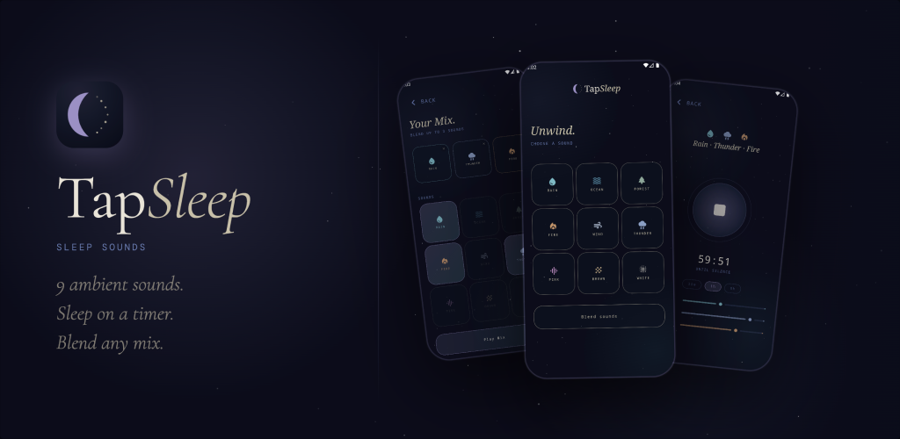

# TapSleep

A sleep sounds app for Android and iOS. Tap a sound, set a timer, and drift off to sleep.

## What it does

TapSleep plays ambient audio to help you fall asleep. Choose from nine sounds or blend multiple together, set a sleep timer, and the app silences itself when the time is up.

**Sounds**
- Rain, Ocean, Forest, Fire, Wind, Thunder
- Pink noise, Brown noise, White noise

**Blend mode** — mix any combination of sounds simultaneously.

**Sleep timer** — 30 min, 1 hour, or 8 hours. Timer counts down on screen and stops playback automatically.

**Breathing orb** — an animated orb pulses slowly while audio plays, giving you something calming to focus on.

**Starfield background** — a subtle animated star canvas behind all screens.

## Tech stack

| Layer | Technology |
|---|---|
| Language | Kotlin 2.0 |
| UI | Compose Multiplatform 1.6.11 |
| Shared module | KMP (`:shared`) — 100% shared UI + logic |
| Android host | `:androidApp` — thin Activity shell |
| iOS host | `iosApp` — SwiftUI entry point calling shared Compose |
| Design system | Material 3 (`darkColorScheme` default) |
| Typography | Cormorant Garamond (serif) + DM Mono (monospace) |
| Resources | `composeResources` — fonts via `org.jetbrains.compose.resources` |
| Build | Gradle 8 + AGP 8.10.1, minSdk 30 |

## Project structure

```
TapSleep/
├── shared/                   # KMP module — all app code lives here
│   └── src/commonMain/
│       ├── kotlin/com/linca/tapsleep/
│       │   ├── audio/        # SoundPlayer expect/actual
│       │   └── ui/           # Screens, components, theme
│       └── composeResources/
│           └── font/         # Cormorant Garamond + DM Mono TTFs
├── androidApp/               # Android Activity
└── iosApp/                   # iOS SwiftUI wrapper
```

## Building

```bash
# Android
./gradlew :androidApp:assembleDebug

# iOS — open iosApp/iosApp.xcodeproj in Xcode
```